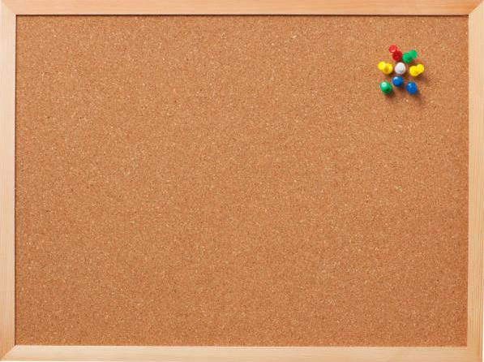
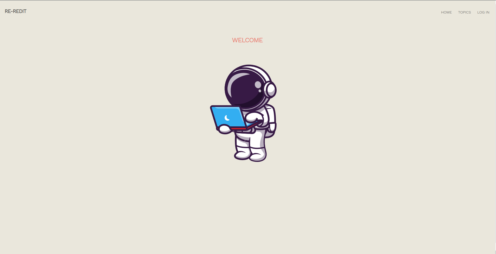
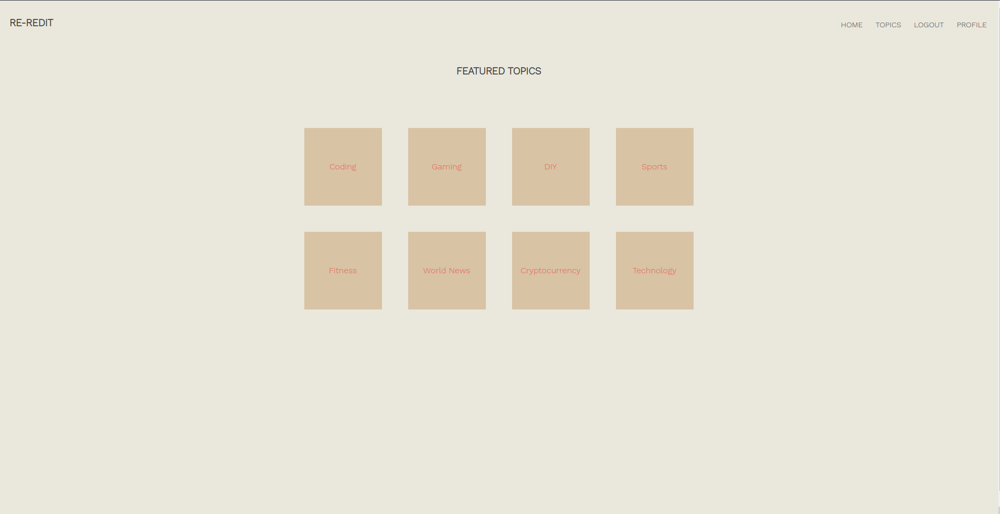
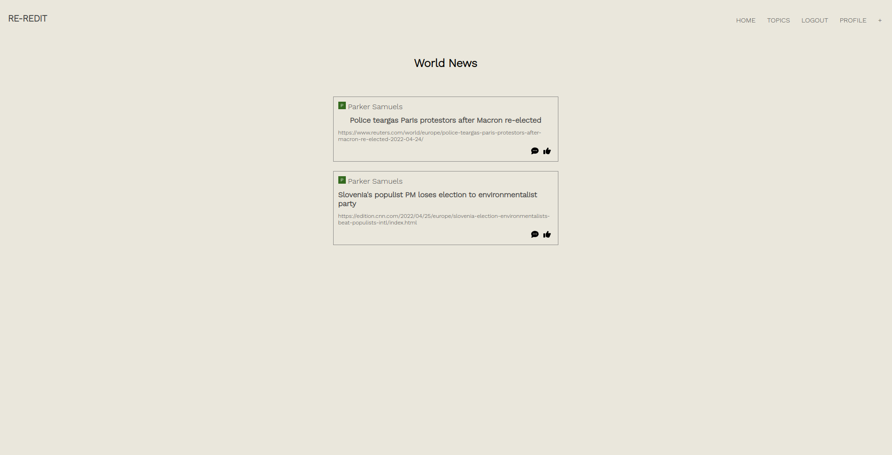
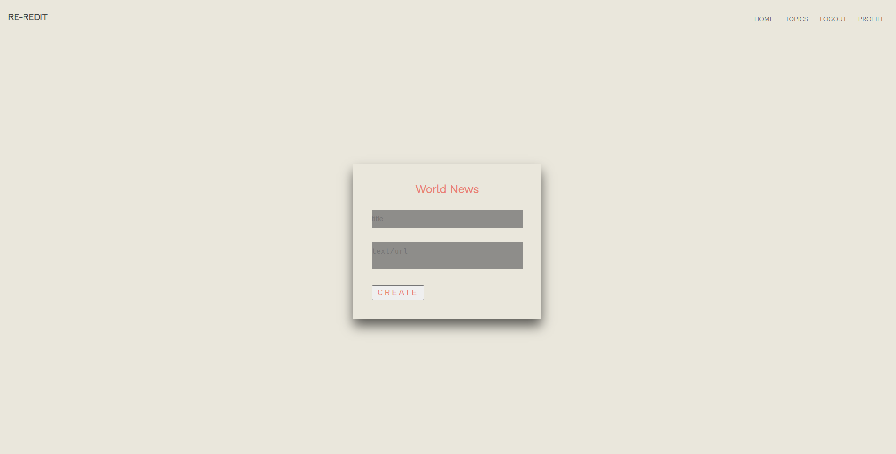
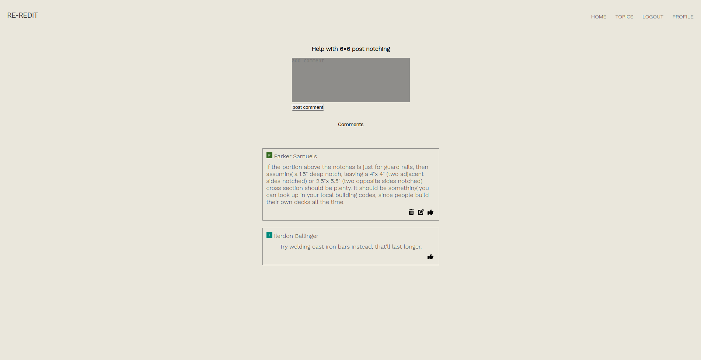
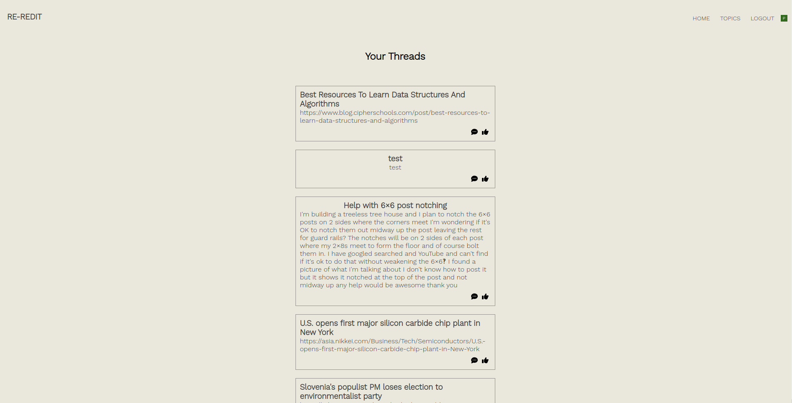

<link rel="images" href="images">

   

  <h1>:space_invader: :robot: Re-Reddit :robot: :space_invader: </h1>
  <h3>Parker Samuels</h3>`                             
  
   
  

<h1>:pencil: Description</h1>

Message Board

 :gear: Functionality

  | Description | Screenshot |
  |------------ | ------------|
  | <h3 align="center">Landing Page</h3> | 
  | <h3 align="center">Topics Page</h3> | 
  | <h3 align="center">Individual Topic</h3> | 
  | <h3 align="center">New Thread</h3> | 
  | <h3 align="center">Individual Thread</h3> | 
  | <h3 align="center">User Posts</h3> | 

## :computer: Technologies Used

 

 

 

<h2> :atom_symbol: Getting Started </h2>
<a href="https://trello.com/b/OR39ZP8b/rereddit">Trello</a>
<a href="https://re-reddit7.herokuapp.com/">Deployed Heroku App</a>

<h3> :calling: Instructions </h3>

  
Community Guidelines

  <ol>
  <li>Post to your hearts content!</li>
  </ol>

## :fast_forward: Next Steps   

### Upcoming Features

- [ ] Upvote/Downvote   

- [ ] Search functionality   

- [ ] Randomized list of topics on landing page

- [ ] Larger list of topics

- [ ] Ability for users to create topics

- [ ] Ability to search for topics